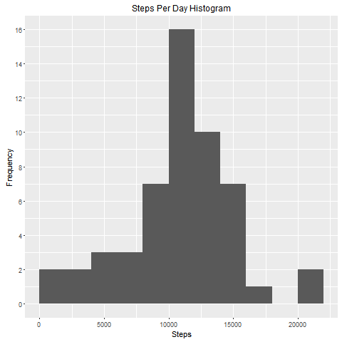
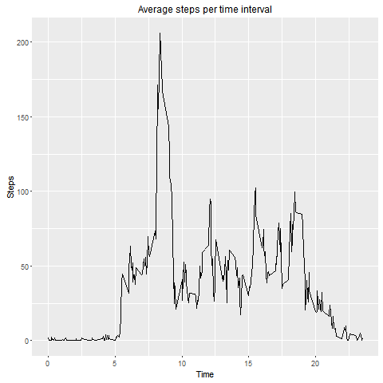
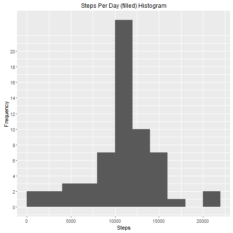
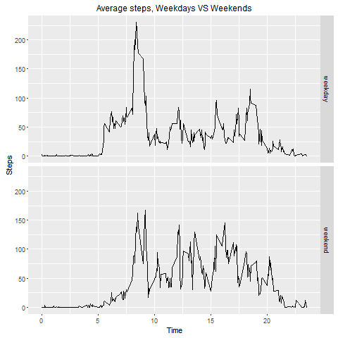

```{r setup, include=FALSE}
knitr::opts_chunk$set(echo = TRUE)
```

# Reproducible Research Course Project 1

The data for the assignment can be downloaded [here](https://d396qusza40orc.cloudfront.net/repdata%2Fdata%2Factivity.zip).  

<br>

###Loading and preprocessing the data

*1. Load the data (i.e. read.csv())*  
*2. Process/transform the data (if necessary) into a format suitable for your analysis*  


```r
# Import data
activity <- read.csv("activity.csv")
# libraries
library(ggplot2)
library(dplyr)
```

   
###Total number of steps taken per day 
*For this part of the assignment, you can ignore the missing values in the dataset.*  
*1. Calculate the total number of steps taken per day*  
*2. If you do not understand the difference between a histogram and a barplot, research the difference between them. Make a histogram of the total number of steps taken each day*  
*3. Calculate and report the mean and median total number of steps taken per day*  
  
**1. Number of steps per day are saved into "StepsPerDay" **

```r
StepsPerDay <- aggregate(activity$steps, list(activity$date), FUN=sum)
colnames(StepsPerDay) <- c("Date", "Steps")
```

**2. Histogram of the total number of steps taken each day**


```r
png('./figure/StepsPerDayHistogram.png')
ggplot(StepsPerDay, aes(Steps))+
geom_histogram(boundary=0, binwidth=2000)+
ggtitle("Steps Per Day Histogram")+
xlab("Steps")+
ylab("Frequency")+
theme(plot.title = element_text(size=12))+
scale_y_continuous(breaks=seq(0,20,2))
dev.off()
```




**3. Mean and median of total number of steps taken per day**

```r
# Mean
mean(StepsPerDay$Steps, na.rm=TRUE)
## [1] 10766.19
```

```r
#Median
median(StepsPerDay$Steps, na.rm=TRUE)
## [1] 10765
```

<br>

###Average daily activity pattern
*1. Make a time series plot (i.e. type = "l") of the 5-minute interval (x-axis) and the average number of steps taken, averaged across all days (y-axis)*   
*2. Which 5-minute interval, on average across all the days in the dataset, contains the maximum number of steps?*   

**1. Time series plot (i.e. type = "l") of the 5-minute interval (x-axis) and the average number of steps taken, averaged across all days (y-axis)*


```r

StepsPerTime <- aggregate(steps~interval,data=activity,FUN=mean,na.action=na.omit)

StepsPerTime$time <- StepsPerTime$interval/100

png('./figure/TimeSeriesPlot.png')
ggplot(StepsPerTime, aes(time, steps))+
geom_line(col="black")+
ggtitle("Average steps per time interval")+
xlab("Time")+
ylab("Steps")+
theme(plot.title = element_text(size=12))
dev.off()
```



**2. 5-minute interval (on average across all the days) with the maximum number of steps**


```r
ST <- tbl_df(StepsPerTime)
ST %>% select(time, steps) %>% filter(steps==max(ST$steps))
##      Interval    steps
## 1    8.35        206.1698
```

###Imputing missing values
*Note that there are a number of days/intervals where there are missing values (coded as NA). The presence of missing days may introduce bias into some calculations or summaries of the data.**  
**1. Calculate and report the total number of missing values in the dataset (i.e. the total number of rows with NAs)*  
*2. Devise a strategy for filling in all of the missing values in the dataset. The strategy does not need to be sophisticated. For example, you could use the mean/median for that day, or the mean for that 5-minute interval, etc.*  
*3. Create a new dataset that is equal to the original dataset but with the missing data filled in.*  
*4. Make a histogram of the total number of steps taken each day and Calculate and report the mean and median total number of steps taken per day. Do these values differ from the estimates from the first part of the assignment? What is the impact of imputing missing data on the estimates of the total daily number of steps?*   

**1. Calculate and report the total number of missing values in the dataset (i.e. the total number of rows with NAs)**

```r
ACT <- tbl_df(activity)
ACT %>% filter(is.na(steps)) %>% summarize(missing_values = n())
##   missing_values
##            (int)
## 1           2304
```

**2.  Devise a strategy for filling in all of the missing values in the dataset. The strategy does not need to be sophisticated. For example, you could use the mean/median for that day, or the mean for that 5-minute interval, etc.**  

```r
# Mean for that 5-minute interval
activity$CompleteSteps <- ifelse( is.na(activity$steps), 
                                  StepsPerTime$steps[match(activity$interval, StepsPerTime$interval)], 
                                  activity$steps)
```

**3. Create a new dataset that is equal to the original dataset but with the missing data filled in.**   

```r
FilledDataset <- data.frame(
                              steps=activity$CompleteSteps, 
                              interval=activity$interval, 
                              date=activity$date)
```

**4. Make a histogram of the total number of steps taken each day and Calculate and report the mean and median total number of steps taken per day. Do these values differ from the estimates from the first part of the assignment? What is the impact of imputing missing data on the estimates of the total daily number of steps?**  


```r
StepsPerDayFull <- aggregate(FilledDataset$steps, list(FilledDataset$date), FUN=sum)

colnames(StepsPerDayFull) <- c("Date", "Steps")

png('./figure/StepsPerDayHistogram_Filled.png')
ggplot(StepsPerDayFull, aes(Steps))+
geom_histogram(boundary=0, binwidth=2000)+
ggtitle("Steps Per Day (filled) Histogram")+
xlab("Steps")+
ylab("Frequency")+
theme(plot.title = element_text(size=12))+
scale_y_continuous(breaks=seq(0,20,2))
dev.off()

```




```r
# Mean
mean(StepsPerDayFull$Steps)
## [1] 10766.19
```

```r
#Median
median(StepsPerDayFull$Steps)
## [1] 10766.19
```

###Are there differences in activity patterns between weekdays and weekends?
*For this part the weekdays() function may be of some help here. Use the dataset with the filled-in missing values for this part.*  
*1. Create a new factor variable in the dataset with two levels - "weekday" and "weekend" indicating whether a given date is a weekday or weekend day.*
*2. Make a panel plot containing a time series plot (i.e. type = "l") of the 5-minute interval (x-axis) and the average number of steps taken, averaged across all weekday days or weekend days (y-axis).*  

**1. Create a new factor variable in the dataset with two levels - "weekday" and "weekend" indicating whether a given date is a weekday or weekend day.**  

```r
FilledDataset$RealDate <- as.Date(FilledDataset$date, format = "%Y-%m-%d")
FilledDataset$weekday <- weekdays(FilledDataset$RealDate)
#Notice that italian names are used for weeksday (as my sistem is setup in italian)
FilledDataset$DayType <- ifelse(FilledDataset$weekday=='sabato' | FilledDataset$weekday=='domenica', 'weekend','weekday')
```

**2. Make a panel plot containing a time series plot (i.e. type = "l") of the 5-minute interval (x-axis) and the average number of steps taken, averaged across all weekday days or weekend days (y-axis)**  

```r

StepsPerTimeDT <- aggregate(steps~interval+DayType,data=FilledDataset,FUN=mean,na.action=na.omit)
StepsPerTimeDT$time <- StepsPerTime$interval/100

png('./figure/Weekdays_VS_Weekends.png')
ggplot(StepsPerTimeDT, aes(time, steps))+
geom_line(col="black")+
ggtitle("Average steps, Weekdays VS Weekends")+
xlab("Time")+
ylab("Steps")+
theme(plot.title = element_text(size=12))+
facet_grid(DayType ~ .)
dev.off()
```

